### EMLOV4-Session-16 Assignment - Kubernetes - IV: IRSA, Volumes, ISTIO & KServe

Deploy LLM/Diffusuion model with AWS EKS service with front end(Next JS), backend(Fastapi) and network configurations like ISTIO, S3 association along with Serving tools like KServe, with monitoring tools like Kiali, prometheus, grafana.

**Note:**
- I have used "OFA-Sys/small-stable-diffusion-v0" with 256x256 resolution image generation instead of SD3-medium with 1024x1024 as the cost of debugging and developing in g6.2xlarge is very high 

- If you take a g6.2xlarge instance it cost 0.4$ per hour even for spot instance so either develop with a small model first with g4dn.xlarge and if eveything works fine go for sd3 models. Else you will end up lossing 5-7 dollars for gpu alone. While developing assignment use a small model + <=256x256 generation image with diffuser. Dont use sd3 or 1024x1024 inference first itself it needs 24GB GPU RAM to load

**Wait paitently see all deletion is successfull in aws cloud formation stack page and then close the system because some times
the deletion gets failed so at backend something would be running and it may cost you high**
**If you triggering a spot instance manually with `peresistent` type ensure that both the spot request is cancelled manually
and the AWS instance is terminated finally**

### Contents

- [Requirements](#requirements)
- [Development Method](#development-method)
    - [Architecture Diagram](#architecture-diagram)
    - [Installation](#installation)
    - [Cluster creation and configuration](#cluster-creation-and-configuration)
    - [Install ISTIO and loadbalancer](#install-istio-and-loadbalancer)
    - [KServe and Helm Deployment](#kserve-and-helm-deployment)
    - [Monitoring and visuvalization](#monitoring-and-visuvalization)
    - [Deletion Procedure](#deletion-procedure)
- [Learnings](#learnings)
- [Results Screenshots](#results-screenshots)

### Requirements

- Redo the SD3 Deployment that we did in the class on KServe
- Create README.mdLinks to an external site.
    - Write instructions to create the .mar file
    - Write instruction to deploy the model on KServe
- What to Submit
    - Output of kubectl get all -A
    - Manifest Files used for deployments
    - Kiali Graph of the Deployment
    - GPU Usage from Grafana and Prometheus while on LOAD
    - Logs of your torchserve-predictor
    - 5 Outputs of the SD3 Model
        - Make sure you copy the logs of torchserve pod while the model is inferencing
    - GitHub Repo with the README.md file and manifests and logs

### Architecture Diagram

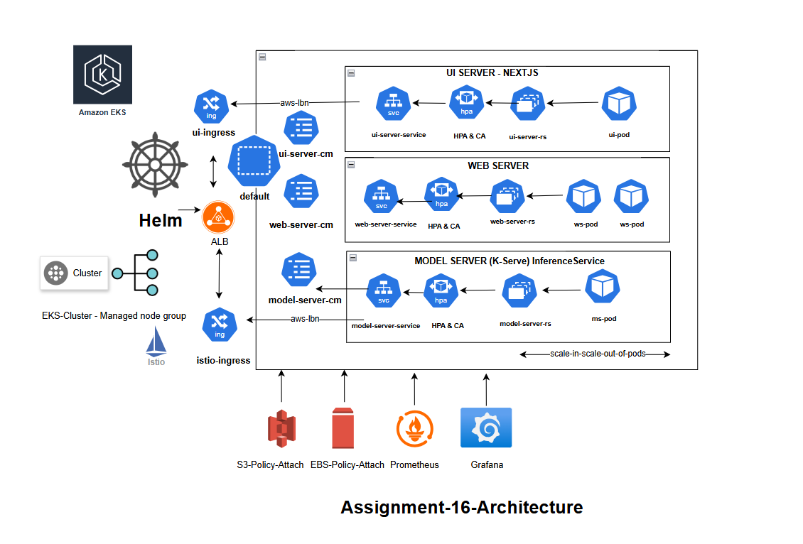

Note: You can refer [class-work](./eks-dev-class-work) and develop the deployments stage by stage similar in session-16 class

Refer: [class-work-readme](./eks-dev-class-work/README.md) for proper usage of classwork files (it gives the commands in proper manner. todo: restructure it)

Note: it took 5$ for doing class work debugging and development and another 7$ for assignment debugging and development as i used g6.2xlarge initially so dont do that mistake.

Local installations (no need a new ec2 instance for doing below work)

### Installation

**AWS install**

```
curl "https://awscli.amazonaws.com/awscli-exe-linux-x86_64.zip" -o "awscliv2.zip"
unzip awscliv2.zip
sudo ./aws/install
```

**Provide credentials**

```
aws configure
```

**EKSCTL Install**

```
# for ARM systems, set ARCH to: `arm64`, `armv6` or `armv7`
ARCH=amd64
PLATFORM=$(uname -s)_$ARCH

curl -sLO "https://github.com/eksctl-io/eksctl/releases/latest/download/eksctl_$PLATFORM.tar.gz"

# (Optional) Verify checksum
curl -sL "<https://github.com/eksctl-io/eksctl/releases/latest/download/eksctl_checksums.txt>" | grep $PLATFORM | sha256sum --check

tar -xzf eksctl_$PLATFORM.tar.gz -C /tmp && rm eksctl_$PLATFORM.tar.gz

sudo mv /tmp/eksctl /usr/local/bin
```

**Set the default ssh-gen key in local**

This default ssh key is used by aws for default ssh login

```
ssh-keygen -t rsa -b 4096
```

**Install kubectl for aws eks in your local**

```
curl -O https://s3.us-west-2.amazonaws.com/amazon-eks/1.32.0/2024-12-20/bin/linux/amd64/kubectl

chmod +x ./kubectl

mkdir -p $HOME/bin && cp ./kubectl $HOME/bin/kubectl && export PATH=$HOME/bin:$PATH
```

**Docker images to ECR**

Build and push docker images to AWS ECR 

Model server

- K-Serve and Kubernetes inference services takes care of it so no need docker for model server

Web server

- `docker build -t web-server -f Dockerfile.web-server .`

UI server

- `docker build -t ui-server -f Dockerfile.ui-server .`

**Model file preparation**

Take a new spot instance **manully** `g4dn.xlarge` and check if it works else go for small model or take larger GPU instance
Use the code inside [model-server/sd3_deploy/test_small_model_infer](./src/model-server/sd3_deploy/test_small_model_infer.py)

- `python test_small_model_infer.py`

Use the code inside [model-server/sd3_deploy](./src/model-server/sd3_deploy/)
```
# Take a g4dn.xlarge instance. 

aws configure

python download_small_model.py 
mkdir -p ../model-store
sh create_mar.sh
sh upload_to_s3.sh
```
Verify inside s3 if you can see all above files. Dont forget to add config folder while uploading

**Note: Make sure you change your account number in all `.yaml` files**

### Cluster creation And configuration

Go into `src/eks-cluster-config` folder. It takes 7-15 minutes based on number of resources you have listed in `.yaml` file for cluster creation

```
eksctl create cluster -f eks-cluster.yaml
```

```
<debug-facts>
# only usefull during debugging

# Create a new nodegroup
# You can comment out a resource and later uncomment it and create the new nodegroup in same cluster
# This can save some cost of gpu nodes. But make sure to create before doing gpu related installations
eksctl create nodegroup --config-file=eks-cluster.yaml

# Delete nodegroup
eksctl delete nodegroup --cluster basic-cluster --name ng-gpu-spot-1

# Delete cluster, Also check in "AWS Cloud Formation" as sometimes even in CLI if its success
in "AWS Cloud Formation" you will get deletion failed.
eksctl delete cluster -f eks-cluster.yaml --disable-nodegroup-eviction

</debug-facts>
```

Check instances which is in EC2

For this to work the defualt ssh should have been configured and it helps in establishing connection with EC2

```
ssh ec2-user@43.204.212.5
kubectl config view
kubectl get all
```

**IRSA for s3 usage**

Ensure [iam-s3-test-policy.json](./src/eks-cluster-config/iam-s3-test-policy.json) is in your current path

```
# Associates an IAM OIDC (OpenID Connect) provider with your EKS cluster. This association allows you to enable Kubernetes
# service accounts in your cluster to use IAM roles for fine-grained permissions.
eksctl utils associate-iam-oidc-provider --region ap-south-1 --cluster basic-cluster --approve

# Create Iam policy
aws iam create-policy --policy-name S3ListTestEMLO --policy-document file://iam-s3-test-policy.json

# Verification
aws iam get-policy-version --policy-arn arn:aws:iam::ACCOUNT_ID:policy/S3ListTestEMLO --version-id v1

# Attach policy to cluster name
eksctl create iamserviceaccount --name s3-list-sa   --cluster basic-cluster   --attach-policy-arn arn:aws:iam::306093656765:policy/S3ListTestEMLO   --approve --region ap-south-1
```

Verify

- `kubectl get sa`
- `aws s3 ls mybucket-emlo-mumbai` - "mybucket-emlo-mumbai" is my bucket name

**EBS on EKS**

```
# Do if need: IAM OIDC association
eksctl utils associate-iam-oidc-provider --region ap-south-1 --cluster basic-cluster --approve

# Service account for ebs usage
eksctl create iamserviceaccount \
  --name ebs-csi-controller-sa \
  --namespace kube-system \
  --region ap-south-1 \
  --cluster basic-cluster \
  --attach-role-arn arn:aws:iam::306093656765:role/AmazonEKS_EBS_CSI_DriverRole

# Create a addon to cluster
eksctl create addon --name aws-ebs-csi-driver --cluster basic-cluster --service-account-role-arn arn:aws:iam::306093656765:role/AmazonEKS_EBS_CSI_DriverRole --region ap-south-1 --force
```

Verify resouces

- `kubectl get nodes -L node.kubernetes.io/instance-type`
- `kubectl get sc`
- `kubectl get sa -n kube-system`

### Install ISTIO and loadbalancer

Istio is an open source service mesh that helps organizations run distributed, microservices-based apps anywhere. Why use Istio? Istio enables organizations to secure, connect, and monitor microservices, so they can modernize their enterprise apps more swiftly and securely.

Setup ISTIO

- `helm repo add istio https://istio-release.storage.googleapis.com/charts`
- `helm repo update`

- `kubectl create namespace istio-system`
- `helm install istio-base istio/base --version 1.20.2  --namespace istio-system --wait`
- `helm install istiod istio/istiod  --version 1.20.2  --namespace istio-system --wait`
- `kubectl create namespace istio-ingress`

```
<debug-facts>
# Could be used if something in istio-ingress service didnt start or didnt get external ip after long time
- helm uninstall istio-ingress istio/gateway --namespace istio-ingress
</debug-facts>
```

Install istio-ingress
```
helm install istio-ingress istio/gateway \
  --version 1.20.2 \
  --namespace istio-ingress \
  --set labels.istio=ingressgateway \
  --set service.annotations."service\\.beta\\.kubernetes\\.io/aws-load-balancer-type"=external \
  --set service.annotations."service\\.beta\\.kubernetes\\.io/aws-load-balancer-nlb-target-type"=ip \
  --set service.annotations."service\\.beta\\.kubernetes\\.io/aws-load-balancer-scheme"=internet-facing \
  --set service.annotations."service\\.beta\\.kubernetes\\.io/aws-load-balancer-attributes"="load_balancing.cross_zone.enabled=true" 
```
- `kubectl rollout restart deployment istio-ingress -n istio-ingress`

Verify
- `kubectl get deployment.apps/istio-ingress  -n istio-ingress`

Note: Install loadbalancer which is few steps away -> Wait for load balancer to become action then run below command -> Check if istio gets an external ip after load balancer is active else redo above ones and debug it. If `istio` didnt get an external ip or if any of its kubernetes resource status is `imagepullfailed` redo above else you cant get an accessible url.


**ALB**

- Assumed policy(`AWSLoadBalancerControllerIAMPolicy`) is already created from session-15 or else refer it

```
eksctl create iamserviceaccount \
--cluster=basic-cluster \
--namespace=kube-system \
--name=aws-load-balancer-controller \
--attach-policy-arn=arn:aws:iam::306093656765:policy/AWSLoadBalancerControllerIAMPolicy \
--override-existing-serviceaccounts \
--region ap-south-1 \
--approve
```

- `helm repo add eks https://aws.github.io/eks-charts`
- `helm repo update`
- `helm install aws-load-balancer-controller eks/aws-load-balancer-controller -n kube-system --set clusterName=basic-cluster --set serviceAccount.create=false --set serviceAccount.name=aws-load-balancer-controller`

Verify

- `kubectl get pods,svc -n istio-system`
- `kubectl get pods,svc -n istio-ingress`

If istio-ingress external ip is not assigned even after load-balancer becomes active use below command after loadbalancer becomes active

- `kubectl rollout restart deployment istio-ingress -n istio-ingress`

**Install Metrics**

- [Metric-Server installaiton reference](https://medium.com/@cloudspinx/fix-error-metrics-api-not-available-in-kubernetes-aa10766e1c2f)

```
<debug-facts>
kubectl delete -f https://github.com/kubernetes-sigs/metrics-server/releases/latest/download/components.yaml
kubectl apply -f https://github.com/kubernetes-sigs/metrics-server/releases/latest/download/components.yaml
Additionally Patching is done in above reference
<debug-facts>
```

Kubernetes Dashboard

- `helm repo add kubernetes-dashboard https://kubernetes.github.io/dashboard/`
- `helm upgrade --install kubernetes-dashboard kubernetes-dashboard/kubernetes-dashboard --create-namespace --namespace kubernetes-dashboard`

- `kubectl label namespace default istio-injection=enabled`

Install the Gateway CRDs

- `kubectl get crd gateways.gateway.networking.k8s.io &> /dev/null || \\
  { kubectl kustomize "github.com/kubernetes-sigs/gateway-api/config/crd?ref=v1.2.0" | kubectl apply -f -; }`

### KServe and Helm Deployment

Apply [istio-kserve-ingress](./src/eks-cluster-config/istio-kserve-ingress.yaml) to create istio class and assign to kserve

- `kubectl apply -f istio-kserve-ingress.yaml`

Install Cert Manager
- `kubectl apply -f https://github.com/cert-manager/cert-manager/releases/download/v1.16.2/cert-manager.yaml`


Install KServe using HELM

- `helm install kserve-crd oci://ghcr.io/kserve/charts/kserve-crd --version v0.14.1`

- `helm install kserve oci://ghcr.io/kserve/charts/kserve \
  --version v0.14.1 \
  --set kserve.controller.deploymentMode=RawDeployment \
  --set kserve.controller.gateway.ingressGateway.className=istio`


**GPU installations**

- `helm repo add nvidia https://helm.ngc.nvidia.com/nvidia  && helm repo update`
- `helm install --wait --generate-name -n gpu-operator --create-namespace nvidia/gpu-operator --version=v24.9.1`
- `kubectl -n gpu-operator logs -f $(kubectl -n gpu-operator get pods | grep dcgm | cut -d ' ' -f 1 | head -n 1)`

Linking S3 policy to Cluster

-` eksctl utils associate-iam-oidc-provider --region ap-south-1 --cluster basic-cluster --approve`

- `eksctl create iamserviceaccount \
	--cluster=basic-cluster \
	--name=s3-read-only \
	--attach-policy-arn=arn:aws:iam::aws:policy/AmazonS3ReadOnlyAccess \
	--override-existing-serviceaccounts \
	--region ap-south-1 \
	--approve`

(not able to move to helm charts but there is a way)

- `kubectl apply -f s3-secret.yaml` 

- `kubectl patch serviceaccount s3-read-only -p '{"secrets": [{"name": "s3-secret"}]}'`

**Helm Installation**

Note:
- Make sure you have updated the istio end point in this file `fastapi-helm/templates/model-server.cm.yml`. istio end point doesnt change untill you reinstall the isitio service in a cluster. So until you dont touch istio services it remains constant.
- Your `ui-server` end point is dynamic for every helm install as its configured inside `fastapi-helm/templates/ui-server.service.yml`

Install fastapi-helm
- helm install fastapi-release-default fastapi-helm --values fastapi-helm/values.yaml

Verify
- kubectl get all

```
<debug-facts>
# Uninstallation
helm uninstall fastapi-release-default

# if uninstallation fails do below
kubectl delete secret sh.helm.release.v1.fastapi-release-default.v1  -n default

# Want to change a image of a pod ? set image pull policy to "Always" update the image in AWS ECR and then delete the pod
# After deletion the cluster recreates now with new image. This helps in faster debugging without need to deleting entire cluster.
kubectl delete pods/web-server-669c6cc8f8-zjvsd 
<debug-facts>
```

Hacks made to make this code work. I was not able to install in any of the existing namespace so only after running below commands i was able to give access to Helm to deploy in preexisting namespaces. `fastapi-release-default` is the helm chart name that user has gives.

```
kubectl label namespace default app.kubernetes.io/managed-by=Helm
kubectl annotate namespace default meta.helm.sh/release-name=fastapi-release-default
kubectl annotate namespace default meta.helm.sh/release-namespace=default
helm install fastapi-release-default fastapi-helm --values fastapi-helm/values.yaml --namespace default
```

**Debugging inside helm pods**

Getting inside a specific pod and having iterative shell
- `kubectl exec -it ui-server-59cb8d9f96-8559p -- /bin/bash`

Check if webservice is reachable from ui-service pods. If some service like ui-server, web-server is not able to be reached get inside the specific pod and do a curl to the service

- `curl -X POST "http://web-server-service/generate_image?text=horseriding"`

While debugging docker files rebuild with no-cache as it may push the same thing again sometimes

- `docker build -t a16/web-server -f Dockerfile.web-server  . --no-cache`

Delete pods but dont worry it recreates automatically to match the replicas
- `kubectl delete pods/web-server-669c6cc8f8-zjvsd`

Use [fake-server.py](./src/model-server/fake_server.py) to setup a server instead of gpu service and verify network configurations and main codes with local docker runs and debugging.

Use [test_sd3_from_local](./src/model-server/sd3_deploy/test_sd3_from_local.py) for testing the model server. Check the pod logs of torchserve predictor only after model loading and if the torchserve established in 8080 port in logs we can tell that its ready to serve.

### Monitoring and Visuvalization

**Install Kiali, prometheus and grafana**

Just run below in linux terminal

```
for ADDON in kiali jaeger prometheus grafana
do
    ADDON_URL="https://raw.githubusercontent.com/istio/istio/release-1.20/samples/addons/$ADDON.yaml"
    kubectl apply -f $ADDON_URL
done
```

For promethues to fetch GPU utilization run following file which is [prometheus.yaml](./src/eks-cluster-config/prometheus.yaml)

- `kubectl apply -f prometheus.yaml`

Port forwarding and visuvalization

- `kubectl port-forward svc/kiali 20001:20001 -n istio-system`

Get to the Prometheus UI
- `kubectl port-forward svc/prometheus 9090:9090 -n istio-system`

Visualize metrics in using Grafana
- `kubectl port-forward svc/grafana 3000:3000 -n istio-system`

Add `DCGM_FI_DEV_GPU_UTIL` panel in promethus so that it can fetch those metrics. Now in Grafana download [nvidia-dcgm dashboard packages](https://grafana.com/grafana/dashboards/12239-nvidia-dcgm-exporter-dashboard/) json file and upload in new dashboard section in grafana. Now you can see GPU metrics

- 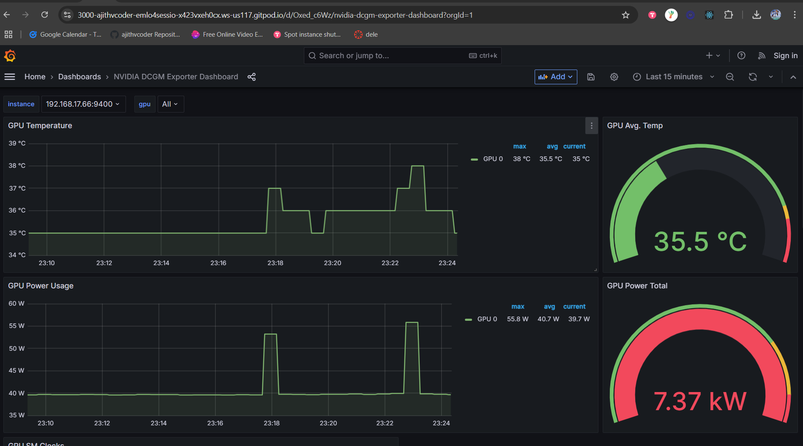

After this you can go to the ui-server url and query it may give some output. After you make 5-10 queries you can see some significant metrics in grafana, promethues and kiali.

- 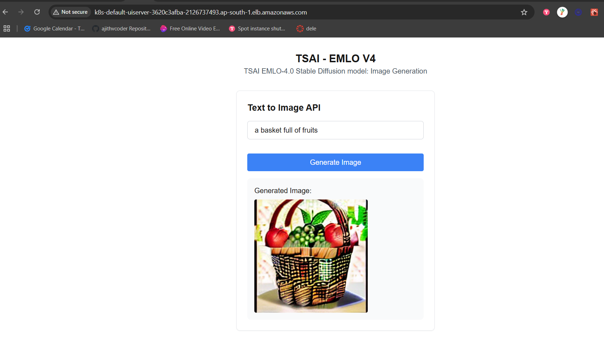

### Deletion Procedure

May through an error as we have did some hacky change for helm install fastapi-release-default
- `helm uninstall fastapi-release-default`  

This will completely uninstall helm's particular resources
- `kubectl delete secret sh.helm.release.v1.fastapi-release-default.v1  -n default`

Delete cluster and all resources
- `eksctl delete cluster -f eks-cluster.yaml --disable-nodegroup-eviction`

Wait paitently see all deletion is successfull in cloud formation and then close the system because some times
the deletion gets failed so at backend something would be running and it may cost you high

### Learnings
- If u force delete resources in CLI it will be running in background so check cloud formation or ec2 instances. But if you do it in "AWS Cloud formation" UI, it will delete all resources completely.
- I could have moved the service account creation to yaml files and could have done it with helm install command but already the assignment took more time so that could be improved.
- Usage of small model in the same `diffusers` and `StableDiffusionPipeline`  module could save more cost in debugging and development time.
- Deletion of pods and auto recreation
    - `kubectl delete pods/web-server-669c6cc8f8-zjvsd` 
- Debugging a particular pod by getting inside it
- `kubectl exec -it ui-server-59cb8d9f96-8559p -- /bin/bash`
- Managing nodegroups through `.yaml` files

    Create nodegroup
    - `eksctl create nodegroup --config-file=eks-cluster.yaml`

    Delete nodegroup
    - `eksctl delete nodegroup --cluster basic-cluster --name ng-gpu-spot-1`

- connecting kserve with istio and managing pods

### Results Screenshots

- Ouput of kubectl get all -A

    - [kubectl get all](./assets/logs/kubectl_logs_all.txt)

- Kiali Graph of the Deployment

    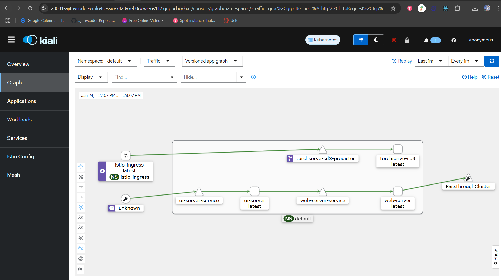

    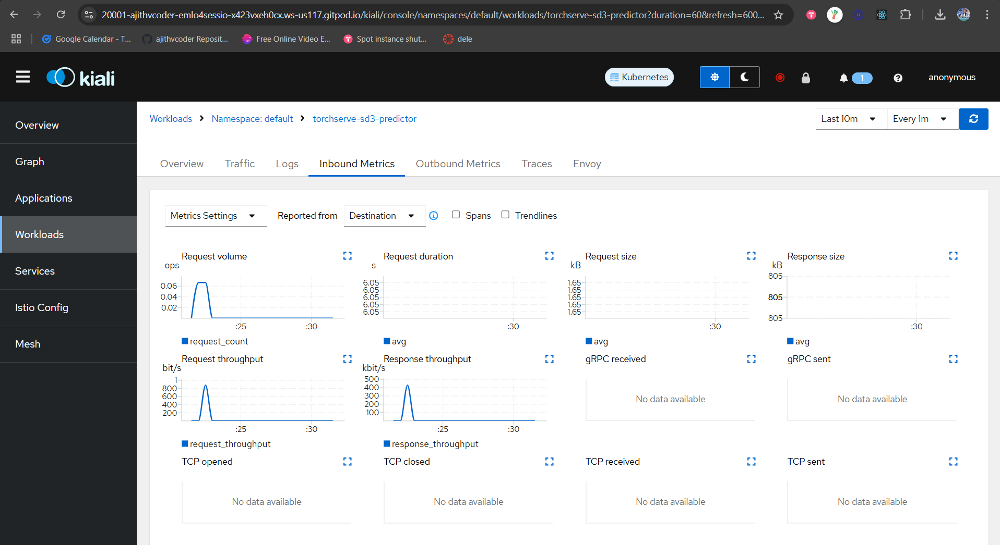

    

- GPU Usage from Grafana and Prometheus while on LOAD

    
    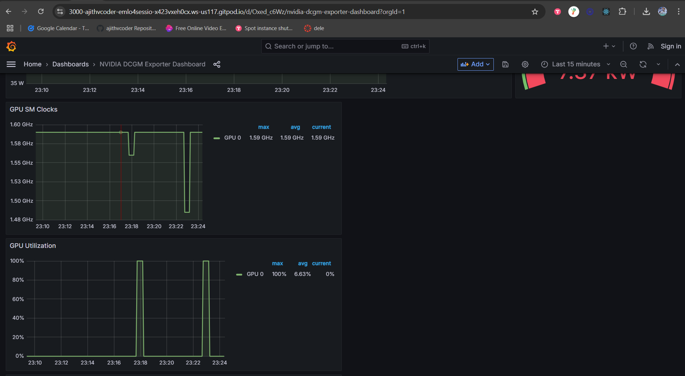
    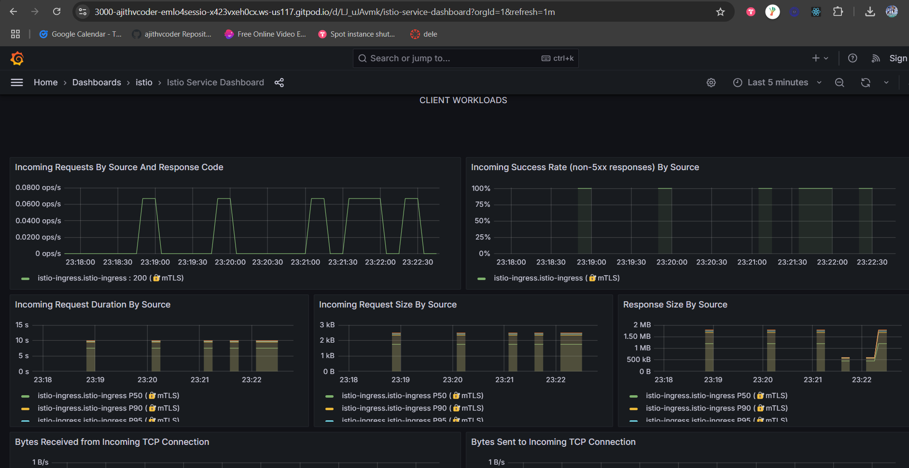
    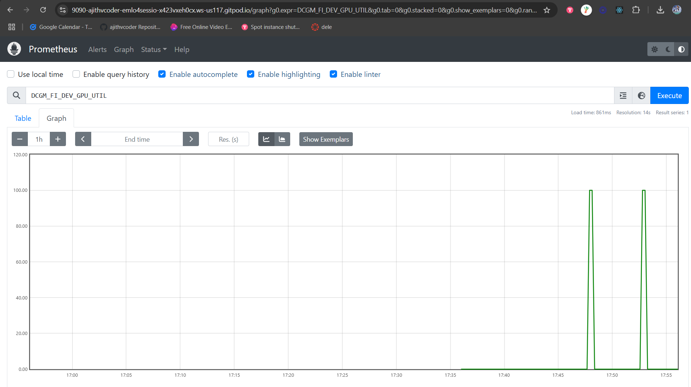

- Logs of your torchserve-predictor

    - [logs of torch serve predictor](./assets/logs/torchserve_logs.txt)

- 5 Outputs of the SD3 Model

    
    
    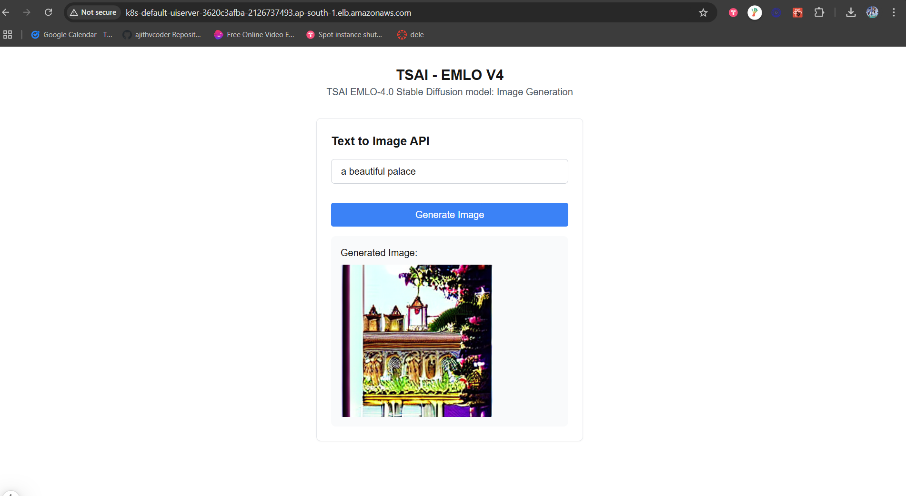
    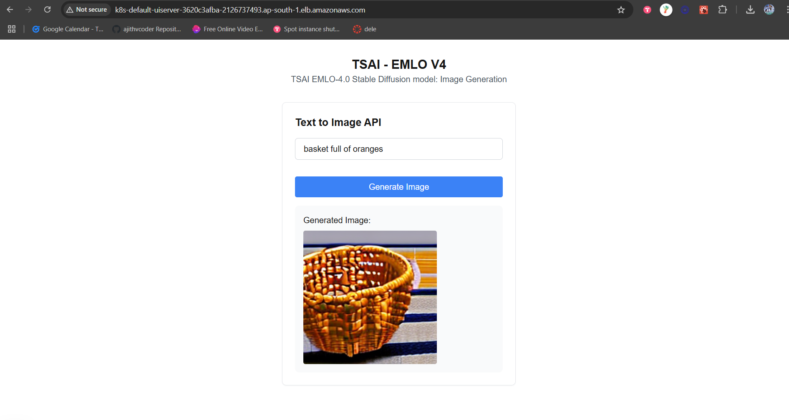
    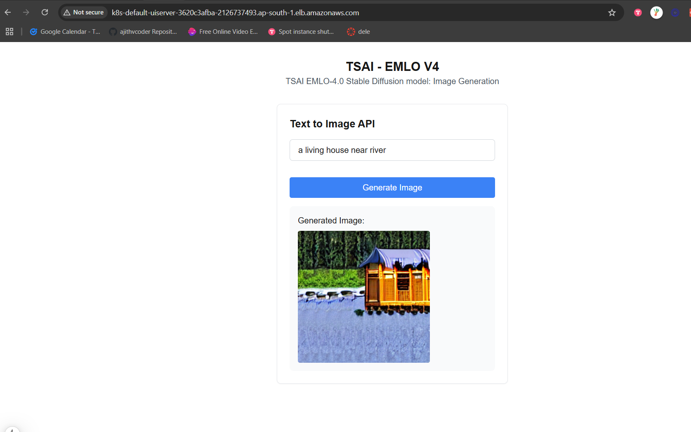

- [logs of torch serve 5 inference](./assets/logs/torchserve_logs.txt)

- Other logs

    - [all logs](./assets/logs/)

- Other Screenshots

    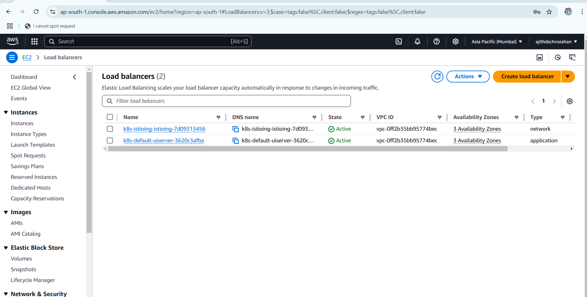
    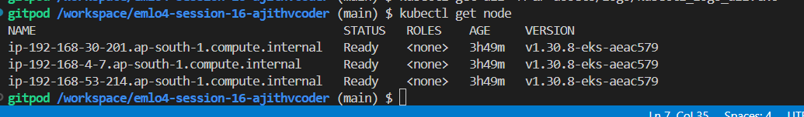
    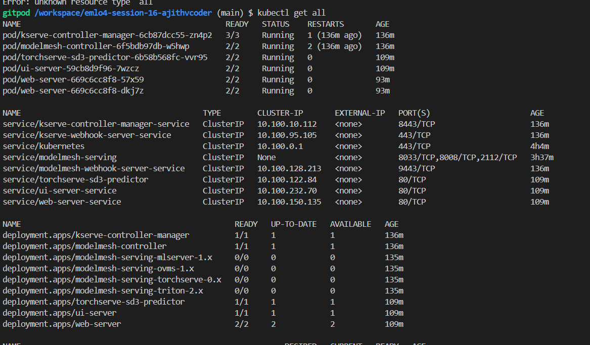
    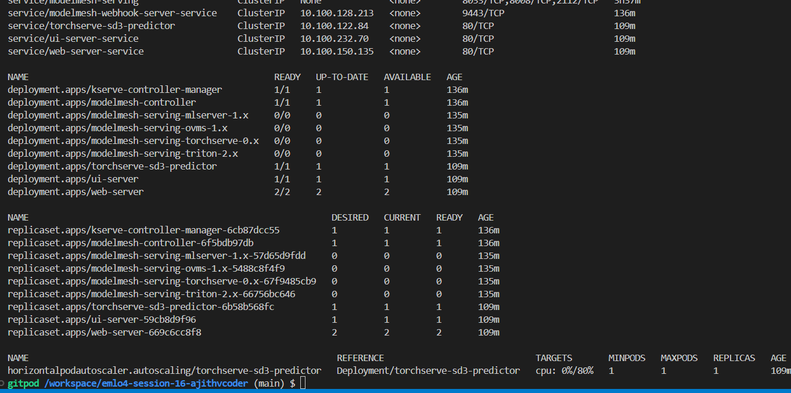


    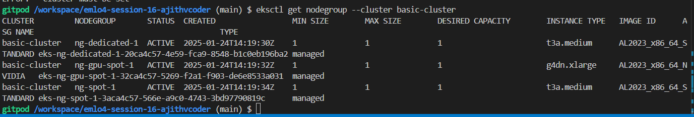
    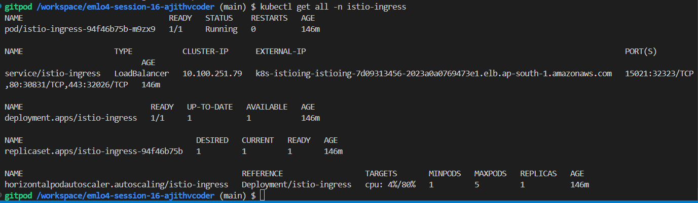

- Architecture

    

### Group Members

1. Ajith Kumar V (myself)
2. Pravin Sagar
3. Hema M
4. Muthukamalan