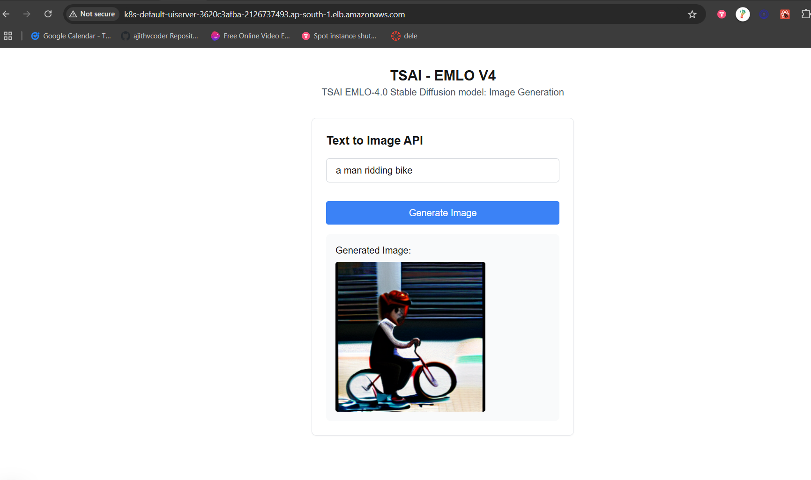

### EMLOV4-Session-16 Assignment - Kubernetes - IV: IRSA, Volumes, ISTIO & KServe

**Note:** 
- I have used "OFA-Sys/small-stable-diffusion-v0" with 256x256 resolution image generation instead of SD3-medium with 1024x1024 as the cost of debugging and developing in g6.2xlarge is very high 

- If you take a g6.2xlarge instance it cost 0.4$ even for spot instance so either develop with a small model first with g4dn.xlarge and if eveything works fine go for sd3 models. Else you will end up lossing 5-7 dollars for gpu alone. While developing assignment use a small model + <=256x256 generation image with diffuser. Dont use sd3 or 1024x1024 inference first itself it needs 24GB GPU RAM to load

**Wait paitently see all deletion is successfull in aws cloud formation stack page and then close the system because some times
the deletion gets failed so at backend something would be running and it may cost you high**

### Contents

- [Requirements](#requirements)
- [Development Method](#development-method)
    - [TODO](#todo)
- [Learnings](#learnings)
- [Results Screenshots](#results-screenshots)

### Requirements

- Redo the SD3 Deployment that we did in the class on KServe
- Create README.mdLinks to an external site.
    - Write instructions to create the .mar file
    - Write instruction to deploy the model on KServe
- What to Submit
    - Output of kubectl get all -A
    - Manifest Files used for deployments
    - Kiali Graph of the Deployment
    - GPU Usage from Grafana and Prometheus while on LOAD
    - Logs of your torchserve-predictor
    - 5 Outputs of the SD3 Model
        - Make sure you copy the logs of torchserve pod while the model is inferencing
    - GitHub Repo with the README.md file and manifests and logs

### TODO

- Will be filled on Jan-25

### Learnings

- Will be filled on Jan-25

### Results Screenshots

Ouput of kubectl get all -A

- [kubectl get all](./assets/logs/kubectl_logs_all.txt)

Kiali Graph of the Deployment

- 
- 
- 

GPU Usage from Grafana and Prometheus while on LOAD

- 
- 
- 
- 

Logs of your torchserve-predictor

- [logs of torch serve predictor](./assets/logs/torchserve_logs.txt)

5 Outputs of the SD3 Model

- 
- 
- 
- 
- 

- [logs of torch serve 5 inference](./assets/logs/torchserve_logs.txt)

Other logs

- [all logs](./assets/logs/)

- 
- 
- 
- 

- 
- 

### Group Members

1. Ajith Kumar V (myself)
2. Pravin Sagar
3. Hema M
4. Muthukamalan